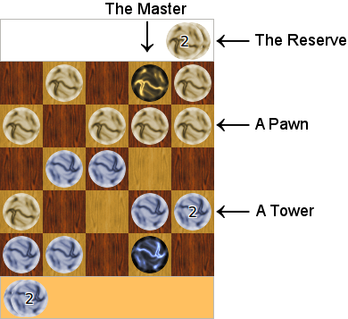
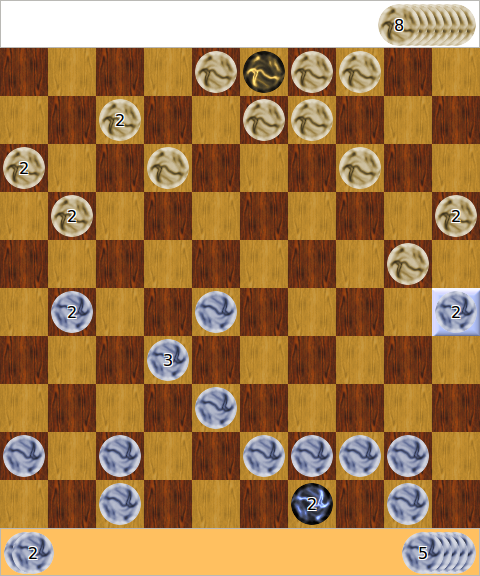

#  

Towers is an original board game for 2 players, written in Racket.

It is licensed under the GPLv3 (see COPYING).

It contains 3 packages/collections:
  * **towers-lib**: Contains the game's rules, the players, the client connection.
  * **towers**: The graphical client. Requires towers-lib, but can run without a server.
  * **towers-server**: The web server. Requires towers-lib. Needed to play network games with the client. Can be installed on a different machine.

# Towers - The Game

A 5x5 game with the basic terms:

A 10x10 middle game:

## Quick summary of the official rules

  * **(goal)** The goal of the game is to capture the opponent's master.
  * **(move points)** The player has as many move points per turn as it has reserve pawns, and may use less than that number.
  * **(move)** Towers can move to the 4 adjacent cells, using as many move points as the height of the tower.
  A tower can move several times per turn.
  * **(raise)** A pawn can move onto another tower of the same player to form a higher tower.
  * **(raise master)** The master can move only onto a single pawn of the player.
  * **(attack)** A tower can attack an opponent's tower of at most the same height, and takes its place on the board.
  * **(capture)** If the master tower attacks an opponent's tower, the opponent's tower is captured and raises the master tower instead of removing it from the board.
  * **(lock)** Attacking or raising a tower locks the destination cell.
        No further action can be done with a locked cell.
        A cell remains locked until the end of the player's turn.
  * **(export)** At the end of the player's turn, any pawn on the player's master returns to the reserve.
  * **(import)** Unused move-points/reserve-pawns can be imported onto the master.
  * **(master out)** Pawns can get out on the master tower one by one (right click and drag).

## Detailed rules

### Reserve pawns and move points

Move points are the number of pawns the player has in its reserve.
The initial number of reserve pawns per player is equal to the width of the board minus 4: 
6 on a 10x10 board, 5 on 9x9, ... and 1 on 5x5.

Reserve pawns are placed outside of the board.
Pawns can be imported from the reserve to the board and vice-versa (see [Importing and exporting](#importing-and-exporting-pawns)).

During a single turn, each player can make as many moves as it has move points.
It is up to the player to decide how these move points are used.

At the beginning of each turn, all the reserve pawns are placed on the left of the board.
Each time a move point is used, one reserve pawn is 
moved from the left side (yet unused reserve pawn side) 
to the right side (used reserve pawn side) of the board.

When the player has used all its move points in the current turn, 
its turn ends and its opponent's turn begins.

The player can also decide to end its turn prematurely by "passing".

### Building and moving towers
 
A single pawn can be moved several times in the same turn.
A pawn can move up, down, left or right as long as the player has sufficient move points 
and the cells it passes over are empty.
A (unlocked) pawn can move several times per turn, and thus can make an L-shaped move for example.

Towers are made of superimposed pawns.
A pawn is a tower of height 1.

To build a tower of height 2, simply move a pawn onto a another pawn of yours.
You can raise towers by putting one pawn at a time onto them.
It is not possible to put a tower onto another tower.

Moving a tower requires as many move points as the height of the tower.
For example, moving a tower of height 3 by 2 cells requires 6 move points.

### Attacking the opponent's pawns and towers
 
A tower T1 can be moved onto an opponent's tower T2, 
thus attacking it,
only if T1 is at least as high as T2.
Then T2 is removed from the board (it does not go to the reserve),
and T1 is placed on the cell where T2 was.

There is one notable exception to the removal rule:
If a tower or a pawn is captured by the master, 
then the master tower is raised by the number of captured pawns.
These captured pawns return to the attacker's reserve at the end of its turn.

The game ends when the opponent's master pawn is captured.

### Locked cells
 
When a pawn is moved onto another pawn/tower (of any player),
i.e., by attacking a tower or raising a tower,
the target cell becomes *locked*.
No further action of the current turn can involve a locked cell.
This means that a locked tower cannot move, 
cannot be raised and cannot attack.

A locked cell is indicated by:

### Importing and exporting pawns
 
#### Exporting pawns
 
Any pawn that lies on top of the master at the end of the turn returns to the reserve.
This is called *exporting pawns*.

This can be used to increase the number of reserve points for the next turn.
This also implies that the master tower is always of height 1 during the opponent's turn, 
and is thus always vulnerable to any opponent's pawn.
But the master can still be temporarily raised to a tower during the player's turn in order 
to attack an opponent's tower. Note that the captured tower is not removed from the board but is 
instead added to the master tower; hence the captured tower goes to the attacker's reserve at the 
end of the turn, giving the player a serious advantage.

As for normal towers, the master tower gets locked after a raise or an attack.

#### Importing pawns
 
At any time during the player's turn, if the master's cell is not locked,
one or more reserve pawn can be *imported* by placing it upon the master.
This cost 1 move point per imported pawn.
This does not lock the master's cell.

The master tower can then be used for attack, 
or imported pawns can be moved out of the master (right-click an drag) 
to an adjacent unlocked cell, one at a time.

#### Example

For example, player A has 2 remaining move points.
It takes one of the points/reserve-pawns and places it on the master pawn
(thus importing and using a move point at the same time).
It now has a tower master of height 2, and 1 remaining move point.
Note: It is useless to import the last move point/reserve-pawn,
since there is no remaining move point to move it out of the master,
and thus the pawn returns to the reserve at the end of the turn.

### Draw game
 
The game is a draw when each player passes one after the other,
or when two successive board positions have already been played exactly the same before.

At the end of a turn, 
if the configuration of the board is the same 
as the one at the beginning of the same turn, 
it is considered a "pass".

### Tips

Towers resist more to attacks, but are also more difficult to move.
Keep in mind that it is not possible to take pawns out of towers, 
so don't build towers that you can't move!

Keep in mind that a single opponent pawn can move by several cells, 
and may not be so far away from your master pawn!
  
Be sure to protect the master because at the end of the turn it returns
to a defense-less pawn, even if you raised it to a tower during your turn.

Also make sure your opponent cannot safely capture some of your pawns with its master,
otherwise this would increase its reserve!
In general, you should not have a lonely pawn that is not "covered" by another one.

### Specific Rules

Beside the official rules, there are a number of alternative rules that can be played with.
You can select them in the dialog box when creating a new game.

## How to play in Towers client

To move one pawn or one tower, simply drag it with the left mouse button.
After that, if you have some remaining move points, you can move that same tower in another direction.

To import a pawn from the reserve onto the board, click on the "Import" button.
It appears on the master.
You can then move it out of the master, by dragging it with the *right* mouse button.

Once you have used all your move points, your turn ends.
Click on the "End turn" button.
If you are playing over the net, your opponent will be informed that you have played.

If you want your turns to always end automatically, you can set that in the Edit/Preferences panel.

You can end your turn prematurely by pressing the "End turn" button if you don't need to use all your move points.

You can also resign a game by pressing the "Resign" button.

